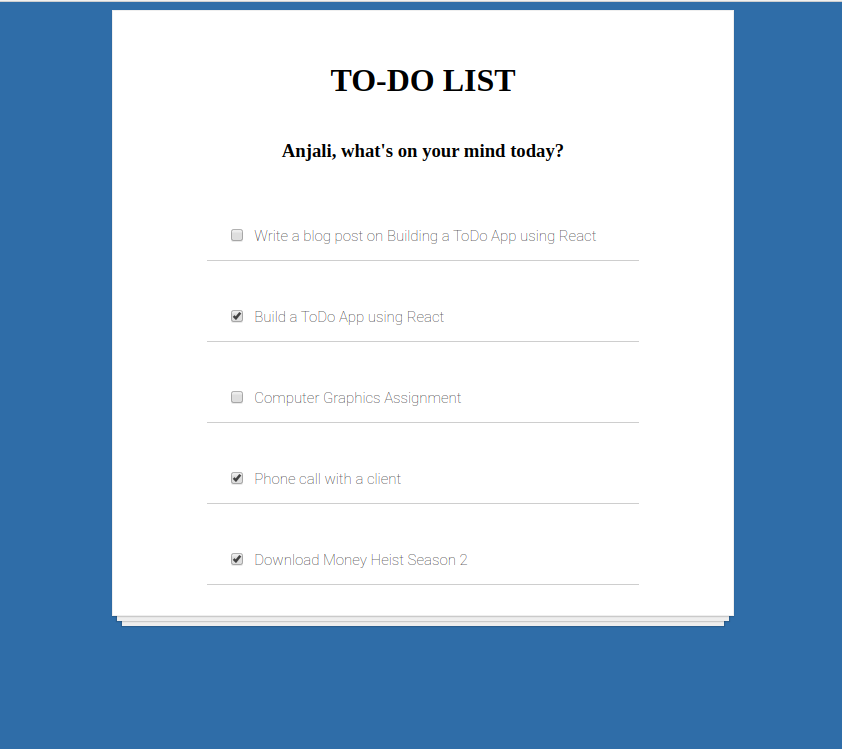
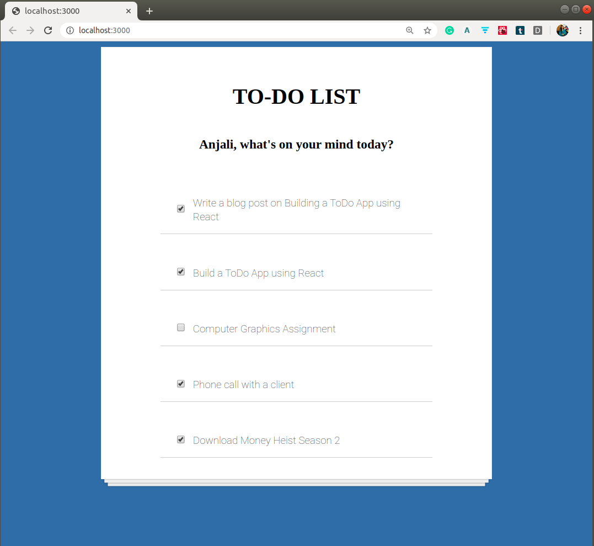

# React To-Do App

A simple To-Do App to understand the basic functionality of React and related concepts

This is motivated by [Scrimba](https://scrimba.com/).

## Screenshot of the To-Do App

## Tutorial Blog Post

So finally, most of the todos for the day are done except the assignment(as always)!

